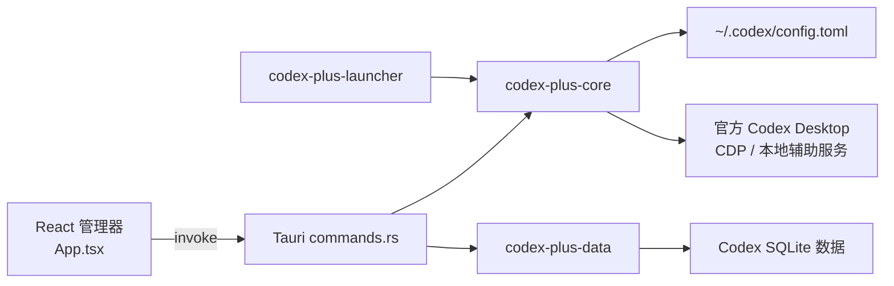

# 青云聚汇（Codex++ 二开）项目指南

> 本文是本地二开基线。功能变更后请同步更新“改造记录”、模块说明与验证结果。

## 项目定位

青云聚汇基于 Codex++ 二次开发，是 OpenAI Codex / ChatGPT Desktop 的外部启动器和管理工具。它通过 Chromium DevTools Protocol（CDP）、本地辅助服务、配置生成和渲染器注入扩展官方应用，不修改官方 `app.asar` 或安装目录。

主要能力：供应商与模型配置、Responses/Chat Completions 协议转换、模型上下文窗口与自动压缩、会话管理/导出/迁移、Provider Sync、启动与注入式增强、用户脚本、插件市场及 Dream Skin。

## 本地基线

| 项目 | 当前值 |
| --- | --- |
| 工作区 | `F:\Community\qdcodex` |
| 产品显示名 | `青云聚汇` |
| 自有仓库 | `https://github.com/qingdi1/QingyunJuhui` |
| 上游仓库 | `https://github.com/BigPizzaV3/CodexPlusPlus` |
| 分支 | `main` |
| 基线提交 | `83bdae033cc7c50bab01f31fafe8653756e82860` |
| 基线说明 | `Merge remote-tracking branch 'origin/pr/1666'` |
| 基线时间 | `2026-07-29T17:54:57+08:00` |
| Workspace 版本 | `1.2.43` |
| 许可证 | `AGPL-3.0-only` |

仓库采用“双远程”维护：`origin` 只用于青云聚汇自己的代码、Issue、Release 和更新检测，`upstream` 只用于读取 CodexPlusPlus 官方更新。远程配置如下：

```powershell
git remote -v
# origin   https://github.com/qingdi1/QingyunJuhui.git
# upstream https://github.com/BigPizzaV3/CodexPlusPlus.git
```

合并官方更新时，先在干净工作区获取上游，再将 `upstream/main` 合并到自有分支。出现冲突时优先保留青云聚汇的品牌、产品级隔离、仓库链接和更新源，再补入上游功能：

```powershell
git fetch upstream
git switch main
git merge upstream/main
npm test --prefix apps/codex-plus-manager
cargo test --workspace
git push origin main
```

## 架构与目录

| 层级 | 技术与位置 | 职责 |
| --- | --- | --- |
| 管理器前端 | React 19、TypeScript、Vite：`apps/codex-plus-manager/src/` | 页面、表单状态、Tauri 调用和前端单测。 |
| 桌面壳 | Tauri 2：`apps/codex-plus-manager/src-tauri/` | 窗口、系统托盘、应用生命周期和 command 边界。 |
| 核心域 | Rust 2024：`crates/codex-plus-core/` | 设置、配置、启动、CDP、注入、代理、更新和系统集成。 |
| 数据域 | Rust + SQLite：`crates/codex-plus-data/` | 会话、导出、Provider Sync、备份和项目迁移。 |
| 启动器 | Rust：`apps/codex-plus-launcher/` | 无界面启动入口，读取已保存设置并启动官方应用。 |
| 移动中继 | Rust：`apps/codex-plus-mobile-relay/` | 独立中继二进制，当前不在 workspace members 中。 |
| 注入资源 | `assets/inject/`、`crates/codex-plus-core/src/assets.rs` | 官方桌面应用的渲染器增强资源。 |
| 打包与 CI | `.github/workflows/`、`scripts/installer/` | Windows NSIS、macOS DMG 和持续集成。 |

根目录 `Cargo.toml` 是 workspace 入口，当前包含 `core`、`data`、`launcher` 和 Tauri 管理器。



## 关键入口与模块定位

- 前端入口：`apps/codex-plus-manager/src/main.tsx`；主界面：`apps/codex-plus-manager/src/App.tsx`。
- Tauri 启动及 command 注册：`apps/codex-plus-manager/src-tauri/src/lib.rs`；command 实现：`apps/codex-plus-manager/src-tauri/src/commands.rs`。新增前端 `invoke` 时，需同时添加 command 并在 `generate_handler!` 注册。
- 设置和供应商模型：`crates/codex-plus-core/src/settings.rs`。
- `config.toml` 生成和写入：`crates/codex-plus-core/src/relay_config.rs`。
- 供应商切换与轮转：`relay_switch.rs`、`relay_rotation.rs`、`relay_environment.rs`。
- 模型后缀与目录：`model_suffix.rs`、`model_catalog.rs`。
- HTTP/协议代理：`proxy.rs`、`protocol_proxy.rs`、`routes.rs`。
- 官方应用路径、启动和进程：`app_paths.rs`、`launcher.rs`、`status.rs`。
- CDP 和渲染器注入：`cdp.rs`、`assets.rs`、`bridge.rs`、`assets/inject/`。
- 用户脚本、插件与主题：`user_scripts.rs`、`plugin_marketplace.rs`、`dream_skin*.rs`。
- 诊断、端口和更新：`diagnostic_log.rs`、`ports.rs`、`update.rs`。
- 本地会话及导出：`crates/codex-plus-data/src/storage.rs`、`markdown.rs`。
- 供应商同步、备份：`provider_sync.rs`、`backup.rs`。

## 数据与安全边界

运行时会读取或写入用户目录：`~/.codex/config.toml`、`~/.codex/auth.json`、`~/.codex/sqlite/*.db`、兼容用 `~/.codex/state_5.sqlite`、青云聚汇状态目录 `~/.qingyun-juhui/`，以及 Provider Sync 备份 `~/.codex/backups_state/provider-sync`。Windows 用户脚本配置独立存放在 `%APPDATA%\QingyunJuhui`。

- 不提交 API Key、`auth.json`、真实 `config.toml`、SQLite 数据库、日志或包含敏感信息的截图。
- 不修改官方应用 `app.asar`、安装目录或签名文件，增强能力沿用 CDP/注入机制。
- 涉及配置写入、数据库删除、迁移或 Provider Sync 时，必须复用或补齐预览、备份、撤销或失败恢复路径。
- 官方桌面应用升级可能改变页面结构、CDP 行为和本地数据格式；涉及注入或数据访问时应进行真实应用的冒烟验证。

## 与原版共存约束

青云聚汇必须能够与原版 Codex++ 同时安装和运行，后续二改不得复用或清理原版的产品级资源：

- 二进制：`qingyun-juhui.exe`、`qingyun-juhui-manager.exe`。
- Tauri / bundle id：`com.qingyunjuhui`、`com.qingyunjuhui.manager`。
- 状态目录：`~/.qingyun-juhui/`；不得回退写入原版 `~/.codex-session-delete/`。
- 单实例端口：Manager `58319`、Launcher `58320`；协议代理默认端口 `58321`。
- URL 协议：`qingyunjuhui://`；不得注册或删除原版 `codexplusplus://`。
- Windows 安装目录和注册表：`QingyunJuhui`；安装/卸载脚本不得终止、删除或覆盖 `codex-plus-plus*`、`Codex++` 快捷方式和注册表项。

两者仍然面向同一个官方 Codex 客户端和 `~/.codex/` 配置目录，因此不要同时在两套管理器中执行供应商切换、注入或恢复操作；这属于被管理目标的共享边界，不是产品安装冲突。

## 品牌与界面基线

- 管理器采用“中国水墨画启发的顶级现代 UI 设计语言”：明卷与夜卷共用暖白到冷炭灰的单色轴，叠加 60px 毛玻璃、宣纸纤维与低密度云母纹理；深色组件使用高粘度未干墨汁胶质高光，明暗两套主题只改变材质亮度，不改变几何、景深、光照方向与层级。
- 形态使用大容器 32/20px、中容器 20/14px、小组件 8px、图标底板 0px 的非均匀圆角阶梯；标题使用 Cormorant Garamond/宋体衬线，正文使用 Inter/黑体无衬线。朱砂红（#B13E2B）只承担交互反馈，石青冷翠（#3C6E6B）承担次级元素，雌黄赭石（#C49A6C）仅用于装饰。
- 侧边栏与工作区使用同一材质映射：明卷为半透明宣纸卷轴，夜卷为高粘度黑漆墨板；导航使用方印式图标底板、宋体标签、朱砂笔锋激活线与雌黄渐隐分隔，折叠后保留 44px 品牌方印和完整可访问名称。
- 本地水墨远山纹理位于 `apps/codex-plus-manager/src/assets/ink-mountains.svg`，由 Vite 内联打包，桌面端离线可用；应用图标源文件为 `apps/codex-plus-manager/src-tauri/icons/app-icon.svg`。
- 管理器窗口标题统一为“青云聚汇 · 云台”，顶部工具栏使用统一尺寸的线性图标，并采用“明卷 / 夜卷”主题命名。
- 鼠标在工作区移动时由 `InkCursorTrail.tsx` 绘制短寿命墨线与飞白颗粒；粗指针、减少动态效果和强制配色环境会自动禁用。
- 首页“青云聚汇中转站”站点入口为 `https://api.qinggekeji.top`。
- 供应商预设中的 API Base URL 为 `https://api.qinggekeji.top/v1`；站点地址和 API Key 地址使用站点根地址。
- 供应商配置页顶部提供青云聚汇默认供应商快速入口：用户只输入 API Key，前端复用通用模型拉取、Provider Doctor 和事务式供应商切换链路，核验通过后才持久化并设为当前供应商；Base URL 与 Responses 协议在快速入口及完整配置中锁定。
- 青云聚汇快速入口不会在界面、提示或诊断日志中回显完整 Key；无 Key 时引导到官网获取，模型拉取与真实请求均设置 30 秒请求超时。
- 管理器运行时代码不再提供 JOJO Code / JOJO Code 包月预设，后续新增中转能力应沿用青云聚汇预设并补充前端测试。

## 开发与验证

前置条件：Rust stable（README 标注 `1.85+`）、Node.js `22`（与 CI 一致）；Windows 构建需 Visual Studio 2022 Build Tools、MSVC v143 和 Windows 10/11 SDK，安装包另需 NSIS；macOS DMG 在 macOS 主机构建。

```powershell
# 前端检查与构建
Set-Location apps/codex-plus-manager
npm ci
npm test
npm run check
npm run vite:build

# 调试 Tauri 管理器
npm run dev
```

```powershell
# 根目录 Rust workspace
Set-Location F:\Community\qdcodex
cargo fmt --all -- --check
cargo test --workspace
cargo build --release
```

Windows Release 产物位于 `target/release/qingyun-juhui.exe` 和 `target/release/qingyun-juhui-manager.exe`。

`apps/codex-plus-mobile-relay` 不在当前 workspace 中，修改它时应从该目录单独运行 `cargo test` 或 `cargo build`。

`npm run build` 会构建启动器并执行 Tauri 构建；Windows NSIS 脚本位于 `scripts/installer/windows/CodexPlusPlus.nsi`，macOS DMG 脚本位于 `scripts/installer/macos/package-dmg.sh`。完整 CI 基准见 `.github/workflows/pr-build.yml`。

## 二开流程

1. 记录需求目标、影响范围，以及是否触及配置、数据库或注入逻辑。
2. 从上方模块定位找到既有服务和测试，优先扩展现有模型，避免在 `App.tsx` 堆叠业务逻辑。
3. 前后端改动按“TypeScript 类型 -> `invoke` 参数 -> Tauri command -> 核心服务 -> 持久化”逐段实现。
4. 配置生成相关变更，补充 Rust 单测断言目标 `config.toml` 文本和隔离/回滚行为。
5. 前端纯逻辑补充同目录 `*.test.ts`；Tauri command 覆盖成功和主要失败路径。
6. 先运行贴近改动的测试，再执行完整前端和 workspace 检查；涉及官方应用交互时做一次桌面端冒烟验证。
7. 更新本文改造记录；较大功能在 `docs/specs/` 或 `docs/plans/` 新建设计文档。

## 改造记录

| 日期 | 变更 | 影响模块 | 验证 | 备注 |
| --- | --- | --- | --- | --- |
| 2026-07-30 | 建立本地二开指南与基线记录 | 文档 | 基于 `main` / `83bdae0` 核对目录、依赖清单和 CI | 未修改产品行为。 |
| 2026-07-30 | 产品更名为青云聚汇，移除管理器推荐页面 | Manager、注入菜单、移动中继、安装入口 | 前端、Rust、构建与运行验证见本次任务记录 | 保留内部 crate/package 名和共享广告源。 |
| 2026-07-30 | 与本机原版 Codex++ 完成产品级隔离 | 二进制、Tauri、状态目录、端口、URL 协议、安装器、Watcher | Manager 40 项、Core 204 项测试通过；workspace check 通过 | 不终止、不删除、不覆盖原版进程、快捷方式、安装目录及注册表项。 |
| 2026-07-30 | 管理器改为拟物化水墨国风，JOJO 中转站替换为青云聚汇中转站 | Manager 样式、品牌入口、供应商预设 | 前端 37 项测试、类型检查、Vite 构建、i18n 与多尺寸界面验收 | 站点入口使用根地址，供应商 API Base 使用 `/v1`。 |
| 2026-07-30 | 视觉调整为羊皮卷水墨拟物风并增加鼠标墨迹 | Manager 样式、Canvas 特效、水墨资产 | 1440/960/760px 深浅主题及墨迹生成、消散验收 | 特效遵循系统动态效果和指针能力设置。 |
| 2026-07-31 | 引入水墨画启发的玻璃宣纸 UI 设计系统 | Manager 材质 token、60px 多层毛玻璃、宣纸纤维/云母纹理、墨胶高光、非均匀圆角与衬线/无衬线排印 | 重新执行前端测试、类型检查、Vite 构建、i18n、1440/960/760px 深浅主题验收 | 对比度保持 WCAG AA；点缀色控制在低占比，背景对比度降低并模糊 3px，前景保持锐利。 |
| 2026-07-31 | 增加青云聚汇默认供应商一键配置 | Manager 快速配置 UI、供应商纯函数、模型拉取与真实请求超时 | 前端 42 项测试、类型检查、Vite/i18n、1440/960/760px 明暗主题验收及 Rust 回归 | 固定站点根地址与 `/v1` API Base；核验通过后才保存并切换，不删除同服务的其他账号配置。 |
| 2026-07-30 | 建立青云聚汇自有仓库与更新发布链路 | Git 远程、关于页、README、Updater、GitHub Actions | 仓库链接审计、Updater 测试、Release 构建与远程推送 | `origin` 维护青云聚汇，`upstream` 仅同步官方更新。 |

## 关联资料

- `README.md`：中文产品说明和安装指南。
- `README_EN.md`：英文说明和开发命令。
- `AGENTS.md`：仓库内工作约定及当前 fork 的专项说明。
- `HANDOVER.md`：历史交接记录，应只作为背景参考。
- `docs/specs/`、`docs/plans/`、`docs/reports/`：已有设计、计划和交付记录。
